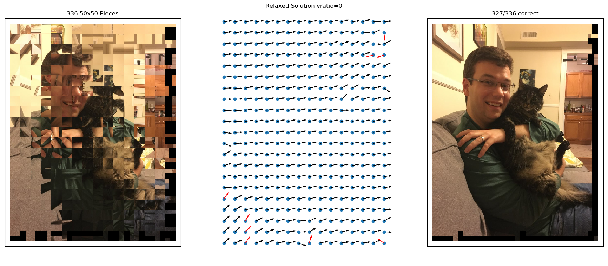

# SquarePuzzles
## <a href = "http://www.ctralie.com">Christopher J. Tralie</a>

The purpose of this code is to solve "type 3 puzzles" (square pieces in correct position, up to a rotation) using the connection Laplacian solution proposed in the following paper [paper]:

Vahan Huroyan, Gilad Lerman, Hau-Tieng Wu, ``Solving Jigsaw Puzzles by The Graph Connection Laplacian.'' ArXiv:1811.03188v2

### Example Puzzle

## Dependencies
* numpy/scipy/matplotlib

## Running
To see all options, run the script as follows
~~~~~ bash
python SquarePuzzles.py --help
~~~~~

For instance, to get the above picture, run
~~~~~ bash
python SquarePuzzles.py --path melayla.jpg --d 50 --seed 0 --animate 0
~~~~~
Change the puzzle by changing the seed

[paper]: <https://arxiv.org/pdf/1811.03188.pdf>
